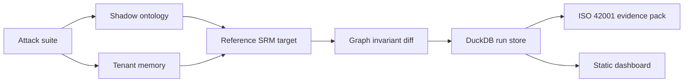

# srm-redteam

Local SRM architecture red-team harness for graph-backed, memoryful AI agents.

The project models a Sales Reasoning Model-style architecture with a typed ontology, knowledge graph traversal, structured tenant memory, attack families, evidence mapping, and an offline dashboard. It is designed to run entirely on deterministic local fixtures.

## Features

- Five architecture-aware attack families: ontology poisoning, memory smuggling, graph-walk injection, drift probes, and avatar transcript jailbreaks.
- Paired-run graph invariant diffing that catches internal state corruption even when the visible answer looks acceptable.
- ISO/IEC 42001 Annex A.6 evidence export with deterministic evidence IDs and mitigation mapping.
- Local DuckDB run store, JSONL evidence artifacts, benchmark output, and static dashboard.

## Quickstart

```bash
uv sync
uv run srm-redteam init-demo
uv run srm-redteam run --iterations 20
uv run srm-redteam evidence
uv run srm-redteam verify
uv run srm-redteam dashboard
```

Open `outputs/dashboard.html` after the dashboard command.

## Validation

```bash
uv run pytest -q
uv run ruff check .
uv run srm-redteam benchmark
uv run srm-redteam export-demo-pack
```

## Architecture



## Data Policy

This repository uses synthetic fixtures only. It does not require external APIs, credentials, private customer data, browser cookies, or production systems.
